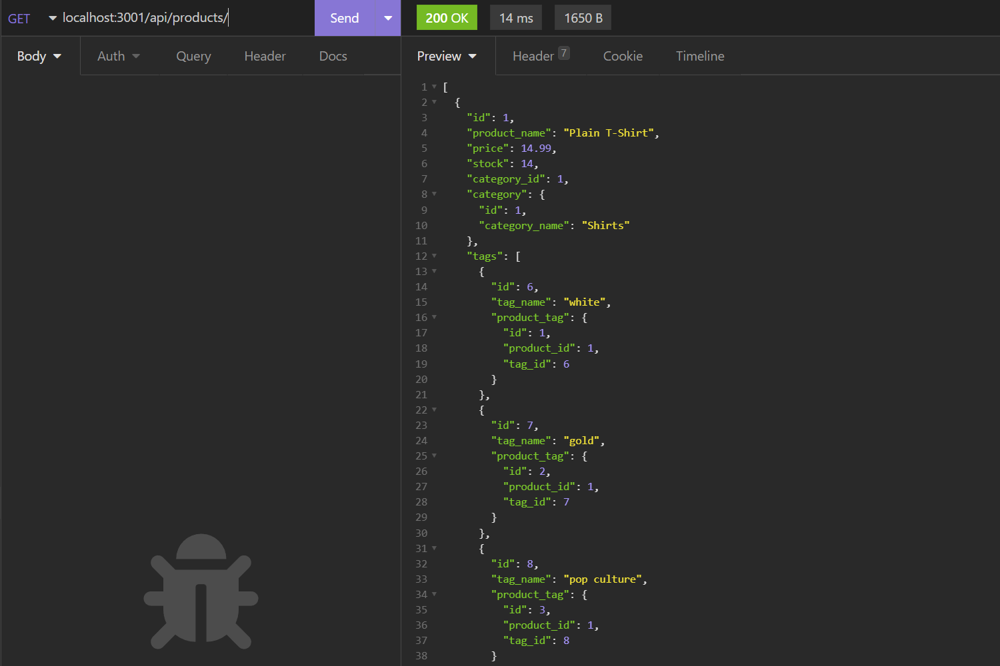
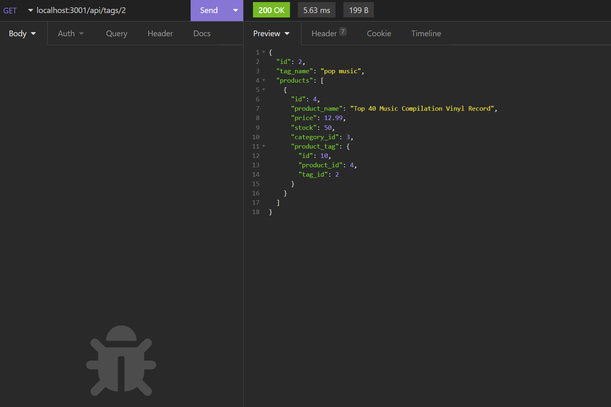

# E-Commerce Back End  
[](https://opensource.org/licenses/MIT)   

## Description  

The purpose of this is to create a program which allows businesses use an Express.js API to use Sequalize to interact with their MySQL database.

## User Story

```md
AS A manager at an internet retail company
I WANT a back end for my e-commerce website that uses the latest technologies
SO THAT my company can compete with other e-commerce companies
```

## Acceptance Criteria

```md
GIVEN a functional Express.js API
WHEN I add my database name, MySQL username, and MySQL password to an environment variable file
THEN I am able to connect to a database using Sequelize
WHEN I enter schema and seed commands
THEN a development database is created and is seeded with test data
WHEN I enter the command to invoke the application
THEN my server is started and the Sequelize models are synced to the MySQL database
WHEN I open API GET routes in Insomnia for categories, products, or tags
THEN the data for each of these routes is displayed in a formatted JSON
WHEN I test API POST, PUT, and DELETE routes in Insomnia
THEN I am able to successfully create, update, and delete data in my database
```

## Table of Contents  
1. [Description](#description)  
2. [Installation](#installation)  
3. [Usage](#usage)  
4. [Contributing](#contributing)  
5. [Tests](#tests)  
6. [Questions](#questions)  
7. [License](#license)
## Installation  

1. Download. 
2. Run `npm i` in your terminal.
3. Login to your **mysql** shell and run schema.sql. Optionally, you may also `npm run seeds` to seed the database.
4. Create a .env file in the root and enter the following information:
```
DB_NAME=employees_db  
DB_USERNAME=YOUR_MYSQL_USERNAME_GOES_HERE (default is root)  
DB_PASSWORD=YOUR_MYSQL_PASSWORD_GOES_HERE  
```
5. Enter the command ```npm start```.  

## Usage  

**[Walkthrough Video](https://drive.google.com/file/d/1bmcOn1soIZEP6wXATo3wsAhYo2cORi4V/view?usp=sharing)**

 

 

 

## Contributing  

Follow best practices for naming conventions, indentation, quality comments, etc.  

## Tests  

A seeds folder is included for testing purposes.

## Questions  

If you have any questions, please reach out to me either on Github or by Email.
  - **Github:** [mmelan000](https://github.com/mmelan000)
  - **Email:** [m.melanson000@gmail.com](mailto:m.melanson000@gmail.com)

## License  

- [MIT](https://opensource.org/licenses/MIT)

